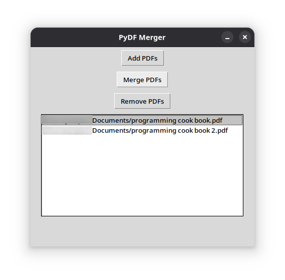

# PyDF Merger - Python PDF Merger Application

**Version**: 2.0.0

**Author**: Joa98

<p align="center">
  
</p>


PyDF Merger is a Python-based desktop application that allows users to easly merge multiple PDF documents into a single file or split a PDF document into multiple files. With its clean and user-friendly GUI, it simplifies the tedious task of organizing and merging scattered PDF files into one document. All in few clicks.

Built with the Tkinter and PyPDF2 libraries.

## 🚀 Features

* Merge multiple PDF documents into a single file.
* User-friendly GUI.
* Does not require internet conection (entirely offline)
* Never stores any users data.

## 🗃️ Requirements

* **Python 3.10+**
* **PyPDF2** (installed via `requirements.txt`)
* Linux/Windows/macOS

## ⚙️ Installation

### 🐧 Linux(Debian/Ubuntu)

```
# Install Python and Git
sudo apt update && sudo apt install python3 python3-pip git
cd pydf_merger

# Clone the repository
git clone https://github.com/Joa98Dev/pydf-merger.git

# Set up a virtual envrionments
Python3 -m venv
source venv/bin/activate

# Install dependencies
pip install -r requirements.txt

# Run the app
python main.py
```

### 🐧 Linux (Arch)

```
# Install Python and Git
sudo pacman -S python python-pip git

# Clone the repository
git clone https://github.com/Joa98Dev/pydf-merger.git
cd pydf_merger

# Set up a virtual environment
python -m venv venv
source venv/bin/activate

# Install dependencies
pip install -r requirements.txt

# Run the app
python main.py
```

### 🪟 Windows 10/11

```
# Install Python from https://python.org (check "Add to PATH" during installation)
# Open CMD/PowerShell as Administrator

# Clone the repo
git clone https://github.com/Joa98Dev/pydf-merger.git
cd pydf_merger

# Set up a virtual environment
python -m venv venv
venv\Scripts\activate

# Install dependencies
pip install -r requirements.txt

# Run the app
python main.py
```

### 🍎 macOS

```
# Install Homebrew (if not installed)
/bin/bash -c "$(curl -fsSL https://raw.githubusercontent.com/Homebrew/install/HEAD/install.sh)"

# Install Python and Git
brew install python git

# Clone the repo
git clone https://github.com/Joa98Dev/pydf-merger.git
cd pydf_merger

# Set up a virtual environment
python3 -m venv venv
source venv/bin/activate

# Install dependencies
pip install -r requirements.txt

# Run the app
python3 main.py
```

## How to use it?

1. Open the PyDF Merger App
2. Click the **Add PDFs** button to open and search your PDFs.
3. On the new window click select your PDFs and click on the **Open** button.
4. The PDFs documents will be show in the listbox.
5. Now just press the **Merge PDFs** button to merge all the documents into a single PDF file.
6. If you want to remove any file, just select the PDF documents on the listbox and press **Remove PDFs** button.
